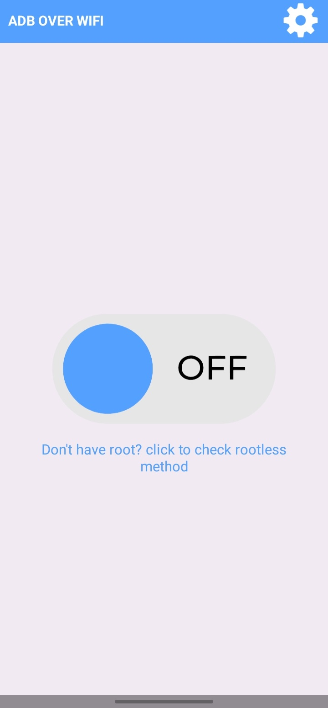
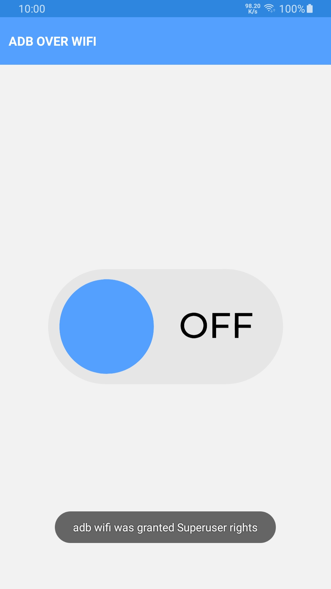

# simple-adb-wifi

Simple app to enable adb over wifi for android [Download](https://github.com/theshoqanebi/simple-adb-wifi/releases/download/v1.0/app-release.apk)

build with gradle version `7.3.3-all` and android gradle plugin version `7.1.2` and android studio version `Bumblebee | 2021.1.1 Patch 2`

|  |   |
| ---------------------------------------------- | -------------------------------------------- |
