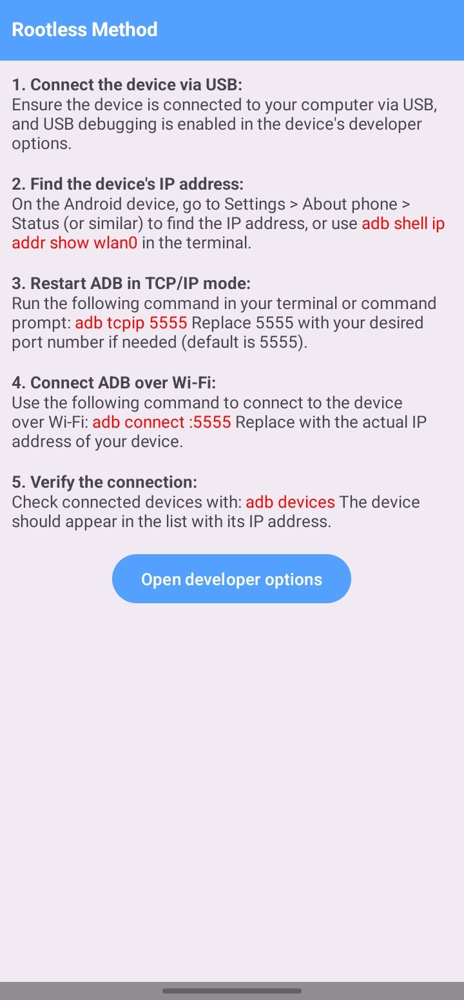

# Simple ADB WiFi
A straightforward Android application to enable ADB over Wi-Fi. Root access is required to utilize this feature [Download](https://github.com/theshoqanebi/simple-adb-wifi/releases/download/v1.0/app-release.apk)

# Features
1. Wireless ADB Activation: Seamlessly enable ADB over Wi-Fi on your Android device.

2. Minimalistic Design: Focused on functionality with a clean user interface.

# Preview

