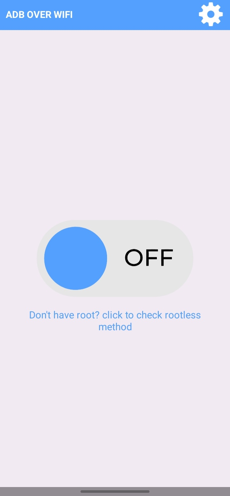
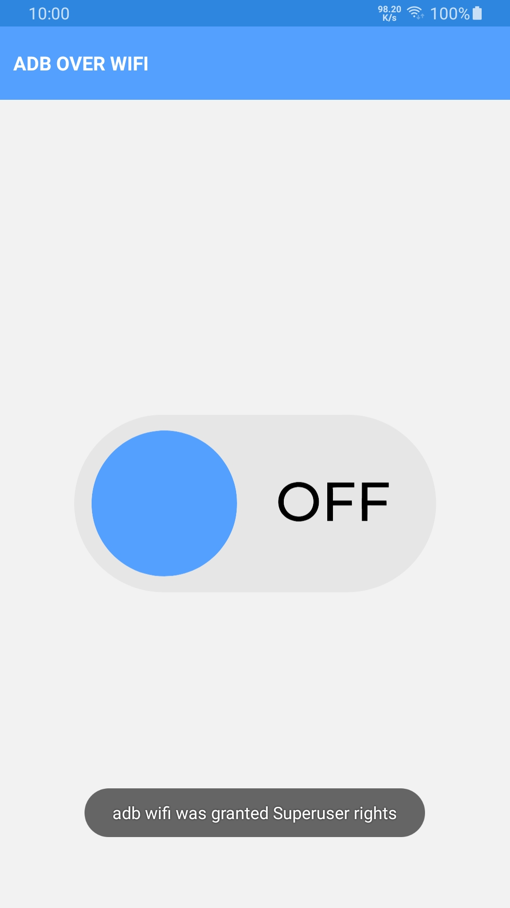
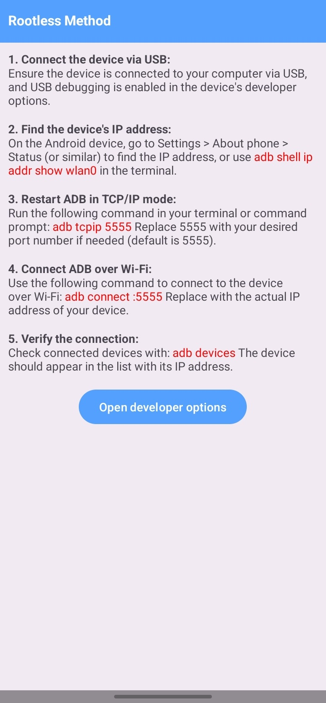

<h1 align="center">📱 Simple ADB WiFi</h1>

<p align="center">
A lightweight Android app to enable <b>ADB over Wi-Fi</b> with one tap.<br>
<sub>⚙️ Root access is required</sub>
</p>

<p align="center">
  <a href="https://github.com/theshoqanebi/simple-adb-wifi/releases/download/v1.0/app-release.apk">
    
  </a>
  <a href="https://github.com/theshoqanebi/simple-adb-wifi">
    
  </a>
  <a href="https://github.com/theshoqanebi/simple-adb-wifi">
    
  </a>
</p>

---

## ✨ Features

- **📶 Wireless ADB Activation**  
  Seamlessly enable ADB over Wi-Fi on your Android device.

- **🎨 Minimalist Interface**  
  Clean and functional UI — focused purely on utility.

---

## 🖼️ Preview

<p align="center">
  
  
  
</p>

---

## 📦 Installation

1. Download the latest APK from the [Releases](https://github.com/theshoqanebi/simple-adb-wifi/releases) page.  
2. Install it on your Android device (make sure **root** is enabled).  
3. Launch the app → Tap **Enable ADB over Wi-Fi**.  
4. Connect from your PC via:  
   ```bash
   adb connect <device-ip>:5555
